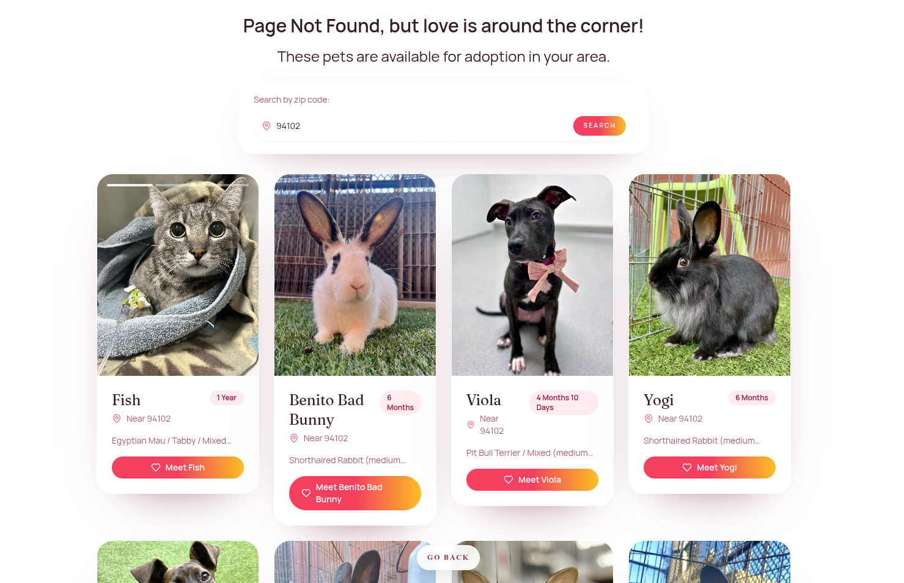

# 404love SDK

[](LICENSE)
[](https://github.com/dariorapisardi/404love/actions/workflows/ci.yml)
[](https://github.com/dariorapisardi/404love/tags)
[](https://linkmag.net/non-existing-page)

404love is a privacy-respecting 404 experience that replaces dead ends with adoptable pets.
Lightweight, no cookies, no tracking, and built to deliver an accessible, tested 404 experience for agencies and site owners.

Star if useful. Open an issue for missing integrations, rescue sources, or accessibility gaps.



## Try it in 60 seconds

1. `npm create next-app@latest 404love-demo`
2. `cd 404love-demo && npm install @404love/next`
3. Create `app/not-found.tsx`:

```tsx
import { createNotFoundPage } from "@404love/next"

export default createNotFoundPage()
```

4. `npm run dev`, then visit `http://localhost:3000/does-not-exist`

## Why teams choose 404love

- Privacy-respecting 404: no cookies, no tracking, no PII.
- An accessible, tested 404 experience for agencies and site owners.
- Content safety: only adoptable pets, no user-generated content.
- Lightweight embed with built-in back navigation to your site.

## Demo / playground

- Live demo:  https://linkmag.net/non-existing-page
- Frame preview: https://404found.love/frame

## Privacy and safety

- No cookies, no tracking, no PII collected by the SDK.
- The only data passed is an optional `referer` URL query param to enable back navigation.
- Content is limited to adoptable pets (no user-generated content).

## Packages

- `@404love/next` in `packages/next`
- For Next.js usage, see [`packages/next/README.md`](packages/next/README.md).

## Skills

Install the 404love Next.js skill with the skills.sh CLI:

```bash
npx skills add dariorapisardi/404love
```

The `404love-next` skill guides App Router integration of `@404love/next`.

## Examples

- [`examples/basic`](examples/basic)

## Contributing

See [`CONTRIBUTING.md`](CONTRIBUTING.md).

## Releases

This repo uses Changesets for versioning and publishing.
